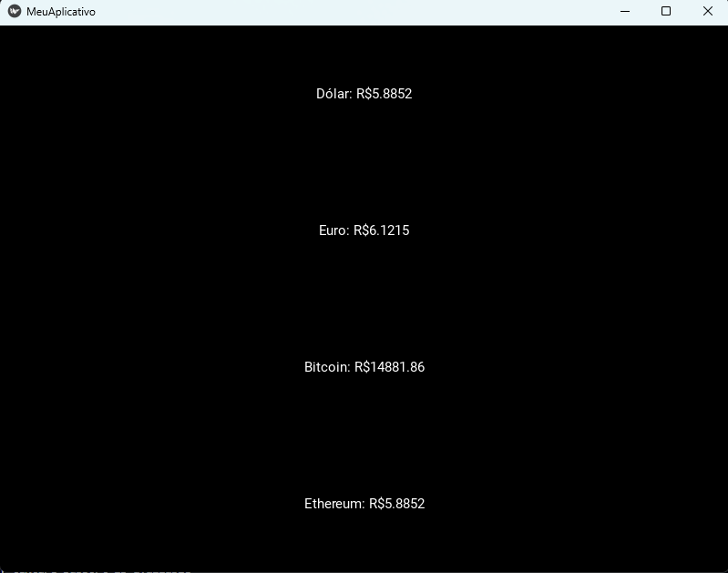

# Aplicativo de Cotação em Tempo Real
---

## Introdução

- Esse é um projeto de cotação de moedas em tempo real que tem o intuito de aprender o uso do framework Kivy para o desenvolvimento de aplicações.

## O que é Kivy?

- Kivy é uma biblioteca de software de código aberto para o desenvolvimento rápido de aplicações equipadas com interfaces de utilizador inovadoras, como aplicações multitoque. Ele vem com suporte nativo para muitos dispositivos de entrada com vários toques, uma crescente biblioteca de widgets com consciência de múltiplos toques e desenho do OpenGL acelerado de hardware. Kivy foi projetado para permitir que você se concentre na criação de aplicativos personalizados e altamente interativos o mais rápido e fácil possível.

## Tecnologias utilizadas

- ([Python](https://www.python.org))
- ([Framework Kivy](https://kivy.org/doc/stable/)
- ([API de cotação](https://docs.awesomeapi.com.br/api-de-moedas)

## Imagem

## Especificações técnicas

- Configurando o ambiente.

Instalar o framework Kivy e a biblioteca requests

~~~cmd
pip install kivy
pip install requests
~~~

- Código padrão para aplicações com Kivy:

~~~Python
# Fazendo importações do kivy 

from kivy.app import App 
from kivy.lang import Builder
import requests

# Criando conexão com o arquivo tela.kv

GUI = Builder.load_file("tela.kv")

# Criando classe do aplicativo 

class MeuAplicativo(App):
    def build(self):
        return GUI

# Inicia o App

MeuAplicativo().run()
~~~

- Na função **on_start** vai as configurações do app sempre que ele estiver aberto. 

~~~Python
def on_start(self):   
        self.root.ids["moeda_1"].text = f"Dólar: R${self.pegar_cotacao('USD')}"
        self.root.ids["moeda_2"].text = f"Euro: R${self.pegar_cotacao('EUR')}"
        self.root.ids["moeda_3"].text = f"Bitcoin: R${self.pegar_cotacao('ETH')}"
        self.root.ids["moeda_4"].text = f"Ethereum: R${self.pegar_cotacao('USD')}"
    
    def pegar_cotacao(self, moeda):
        link = f"https://economia.awesomeapi.com.br/last/{moeda}-BRL"
        requisicao = requests.get(link)
        dic_requisicao = requisicao.json()
        cotacao = dic_requisicao[f"{moeda}BRL"]["bid"]
        return cotacao
~~~

Explicando a linha de código **self.root.ids["moeda_1"].text = f"Dólar: R${self.pegar_cotacao('USD')}"**:

1. self: faz referência a classe **MeuAplicativo**;
2. root: faz referência ao arquivo **tela.kv**;
3. ids["moeda_1"].text: pega o id do atributo no arquivo **tela.kv**;
4. f"Dólar: R${self.pegar_cotacao('USD')}": valor atribuído ao label com concatenação da variável da função **pegar_cotacao** que pega o valor da moeda selecionada.

- Já na função **pegar_cotacao** ela consome os serviços na API.

1. Na variável **link** ela faz a conexão com a API;
2. Na **requisicao** como o próprio nome diz, ela faz a requisição pelo método get com a variável **link** como parâmetro;
3. Em **dic_requisicao** pega o valor em formato json(Javascript Object Notation);
4. **cotacao** vai filtrar o valor da cotação que vai ser mostrado na tela.

